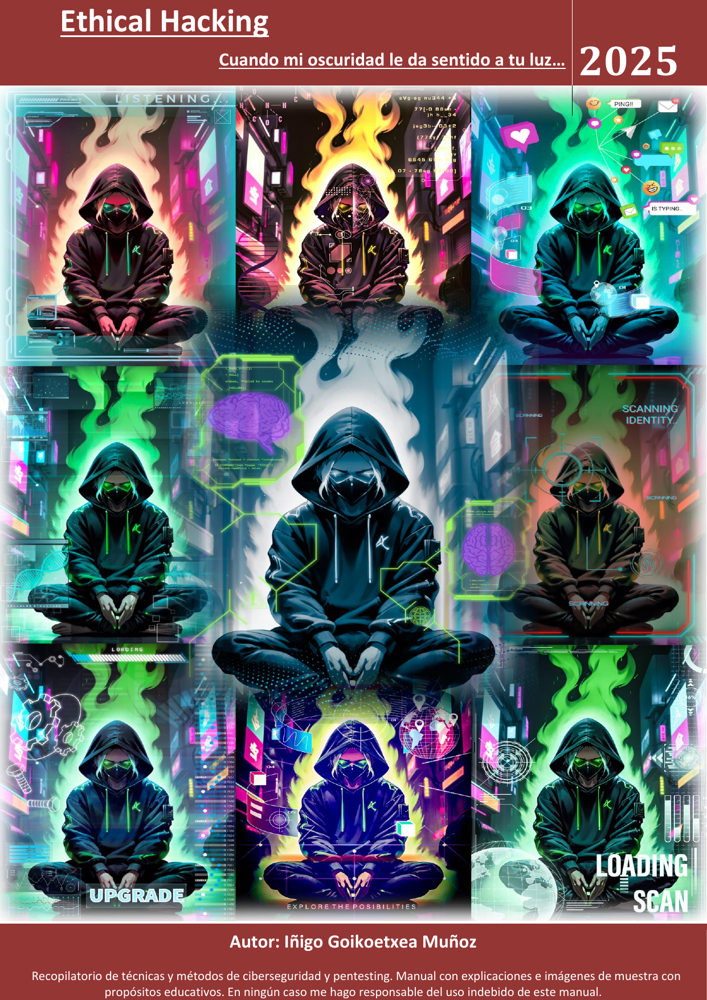
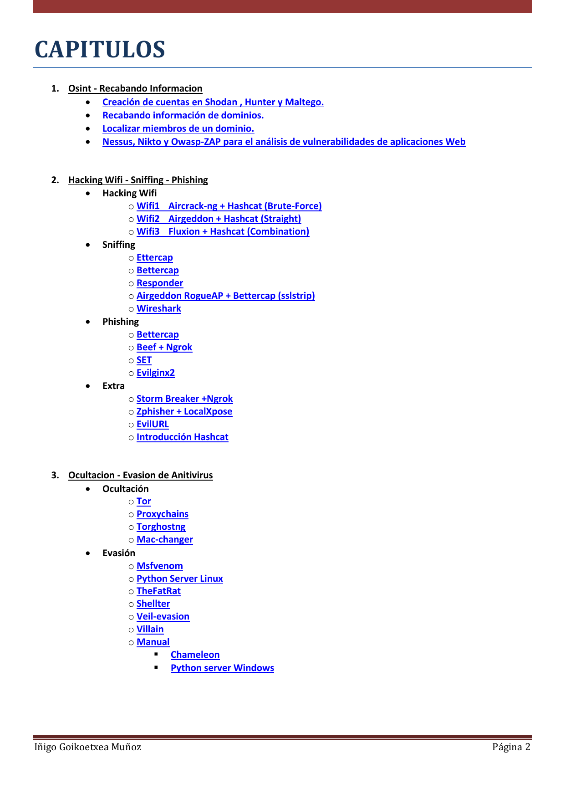
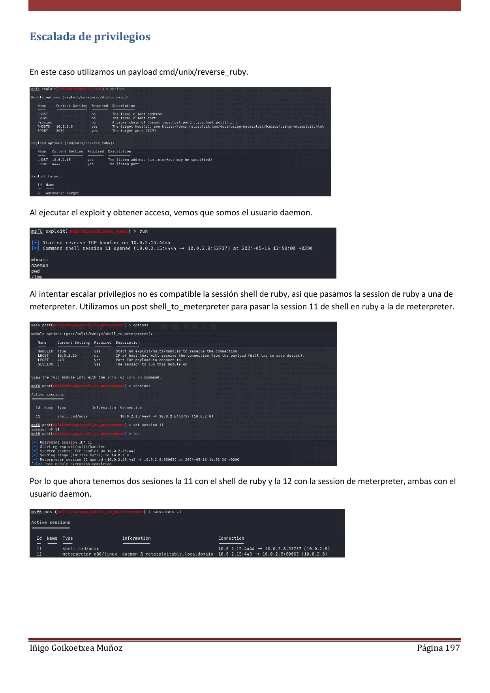
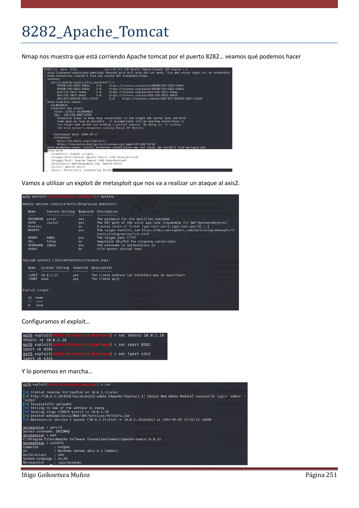
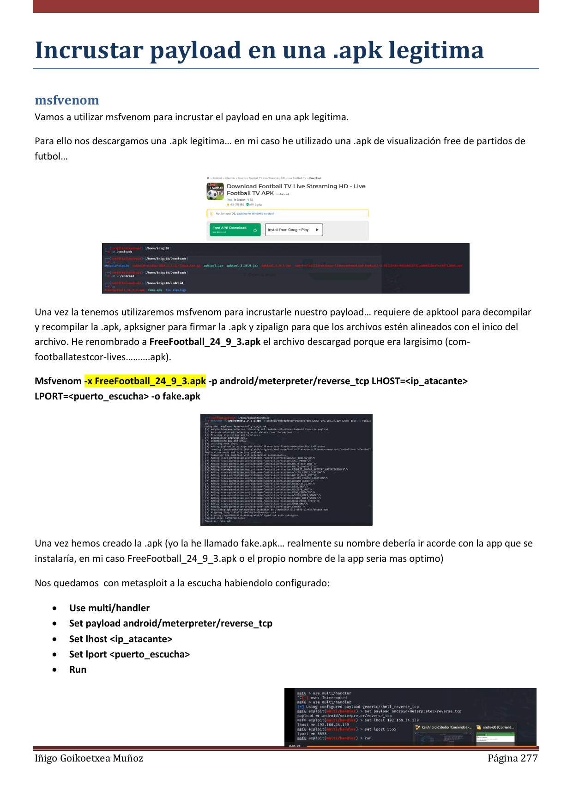
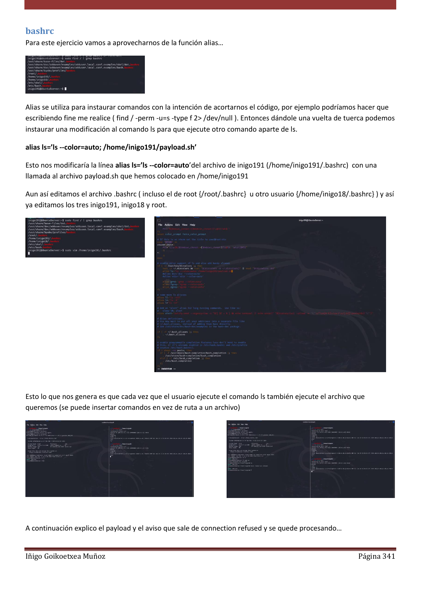
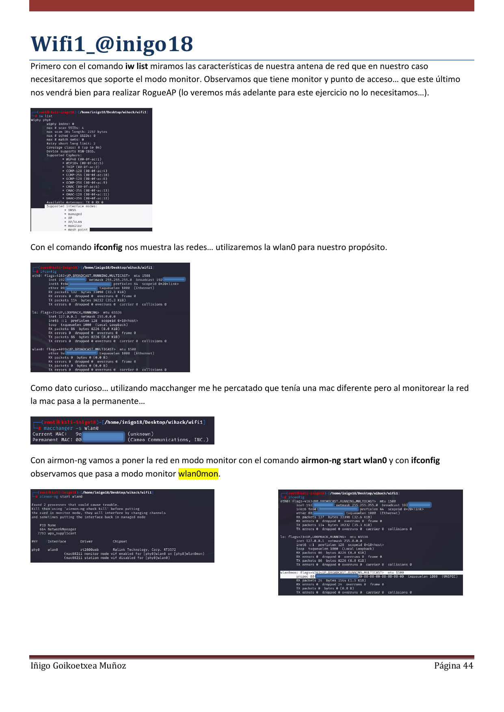
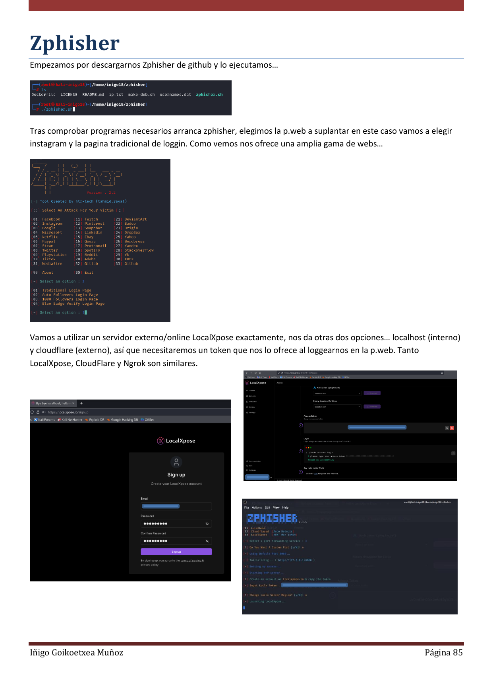

# Curso de Hacking Ético

Este repositorio contiene el material completo del curso en formato PDF.

## Contenido
- **Ethical_Hacking.pdf** (62 MB) - Libro con teoría, prácticas y laboratorios.

## Descarga
Haz clic en el archivo PDF y luego en "Download" para obtenerlo.

## Nota
Este contenido es solo para fines educativos.

## Vista previa de algunas páginas

| Tema | Captura |
|------|---------|
| Portada |  |
| Índice (páginas 3-6) |  |
| Escalada Linux |  |
| Escalada Windows |  |
| Android |  |
| Bashrc |  |
| Wifi |  |
| Zphisher |  |
